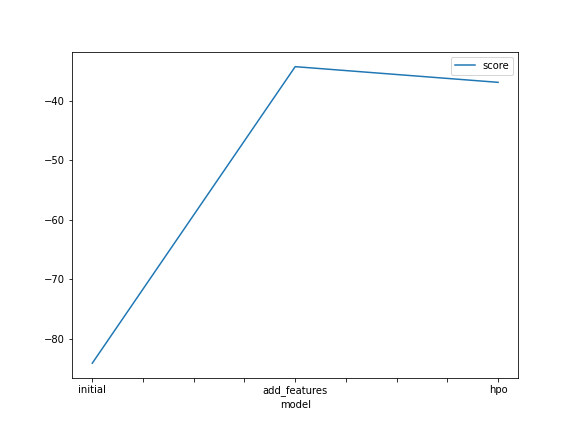
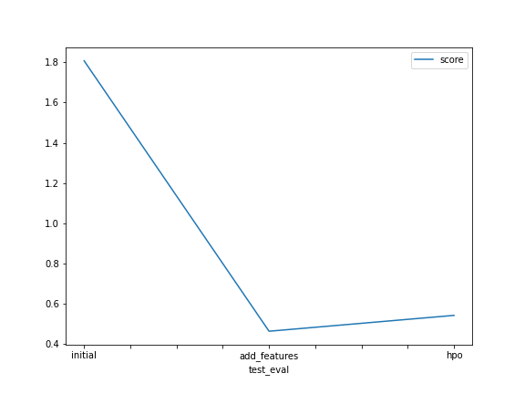

# Report: Predict Bike Sharing Demand with AutoGluon Solution
#### Idris Khattak

## Initial Training
### What did you realize when you tried to submit your predictions? What changes were needed to the output of the predictor to submit your results?
When I submitted the initial predictions to the Kaggle model, it did not perform as well as expected. I realized the need for feature engineering for better results.
         To submit the submission file to Kaggle, I set all negative values to 0 as Kaggle doesn't expect submissions containing negative results.

### What was the top ranked model that performed?
The top-ranked model is the `predictor_new_features` model with a score of `0.46268`, and in contrast of including models `WeightedEnsemble_L3` is top performing model.
        
## Exploratory data analysis and feature creation
### What did the exploratory analysis find and how did you add additional features?
For feature creation, I created 4 new features with `datetime` column including hour, day, month, and year. Additionally, I converted the season and weather columns to categorical columns. 
    
### How much better did your model perform after adding additional features and why do you think that is?
These additional features performed very well in the model to analyze seasonality patterns in the data. The model performance improved by approximately `74.40% `after feature engineering. 

## Hyper parameter tuning
### How much better did your model perform after trying different hyper parameters?
Hyperparameter tuning proved beneficial, resulting in improved model performance with an RMSE score of 0.54150, which is better than the initial model's performance. However, it did not show significant improvement compared to the performance of the new_features_model. 

### If you were given more time with this dataset, where do you think you would spend more time?
I would spend more time on data analysis, creating new features, and scaling features. Furthermore, I will read the documentation of AutoGluon to experiment with different parameters, aiming to enhance the model's performance.

### Create a table with the models you ran, the hyperparameters modified, and the kaggle score.
| Model        | HPO1                                 | HPO2                 | HPO3                   | Score  |
|--------------|--------------------------------------|----------------------|------------------------|--------|
| initial      | default_params                       | default_params       | default_params         | 1.80758|
| add_features | default_params                       | default_params       | default_params         | 0.46268|
| hpo          | GBM: num_leaves: lower=26, upper=66  | NN: dropout_prob: 0.0, 0.5 | GBM: num_boost_round: 100 | 0.54150|

### Create a line plot showing the top model score for the three (or more) training runs during the project.

### Create a line plot showing the top kaggle score for the three (or more) prediction submissions during the project.

TODO: Replace the image below with your own.

## Summary
I utilized AutoGluon to predict bike-sharing demand. Among the models evaluated, "Predictor_new_features" emerged as the top performer, achieving a Kaggle score of `0.462` on the testing data. Through thorough exploratory data analysis (EDA) and feature engineering, the model's performance was significantly enhanced by 74% Additionally, I trained the model with various hyperparameters, performed well as compared to the initial model. 
